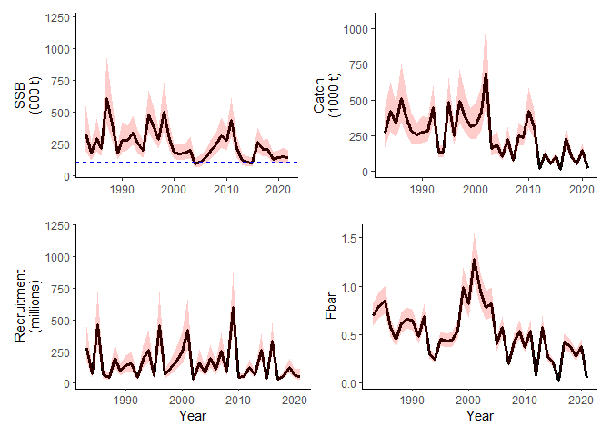

<!-- README.md is generated from README.Rmd. Please edit that file -->

# smsR

<!-- badges: start -->
<!-- badges: end -->

smsR is a seasonal stock assessment model package using TMB to estimate
parameters. The model is the current assessment model for sandeel (4
stocks) and sprat in the North Sea.

## Installation

You can install the development version of smsR from
[GitHub](https://github.com/nissandjac/smsR) with:

``` r
# install.packages("devtools")
devtools::install_github("nissandjac/smsR")
```

## Using the model

The model can be run with the provided data set `{r} sandeel_1r` and the
Sandeel 1r standard configuration as

``` r
library(smsR)


# Set up sandeel for area 1r 

df.tmb <- get_TMB_parameters(
  mtrx = sandeel_1r$lhs, # List that contains M, mat, west, weca
  Surveyobs = sandeel_1r$survey, # Survey observations 
  Catchobs = sandeel_1r$Catch, # Catch observations  
  years = 1983:2021, # Years to run
  nseason = 2, # Number of seasons
  useEffort = TRUE, # Use effort to calculate F
  ages = 0:4, # Ages of the species
  recseason = 2, # Season where recruitment occurs
  CminageSeason = c(1,1), # Minimum catch age per season
  Fmaxage = 3, # Fully selected fishing mortality age
  Qminage = c(0,1),# Minimum age in surveys 
  Qmaxage = c(1,3), # Max age in surveys 
  Fbarage = c(1,2), # Age use to calculate Fbar 
  effort = sandeel_1r$effort, # Effort input 
  blocks = c(1983,1999), # Blocks with unique selectivity 
  nocatch = sandeel_1r$nocatch, # Seasons where F is not calculated 
  surveyStart = c(0.75,0), #
  surveyEnd =  c(1,0), # 
  surveySeason = c(2,1), # 
  surveyCV =  list(c(0,1),c(1,2)), 
  catchCV = list(c(1,3), c(1,3)), # Catch CV groupings 
  estCV = c(0,2,0), # Estimate CVs for 1) survey, 2) catch, 3) Stock recruitment relationship
  beta = 105809, # Hockey stick break point
  nllfactor = c(1,1,0.05) # Factor for relative strength of log-likelihood

)


parms <- getParms(df.tmb)

sas <- runAssessment(df.tmb, parms)
#> Congrats, your model converged
```

<!-- You'll still need to render `README.Rmd` regularly, to keep `README.md` up-to-date. `devtools::build_readme()` is handy for this. -->

The resulting fit to the data can then be visualized in a summary output
showing SSB, Catch, recruitment and Fbar as

``` r

plot(sas, printFig = FALSE)
```



Or to evaluate the retrospective patterns as

``` r

mohns_rho(df.tmb, peels = 5, parms = parms)
#> Congrats, your model converged
#> Congrats, your model converged
#> Congrats, your model converged
#> Congrats, your model converged
#> Congrats, your model converged
#> Congrats, your model converged
#> Warning: Removed 6 rows containing missing values (`geom_line()`).
#> Removed 6 rows containing missing values (`geom_line()`).
```


    #> $df.save
    #>     years       SSB         R       Fbar peel convergence
    #> 1    1983 328333.14 277765474 0.70060866    0        TRUE
    #> 2    1983 326931.17 276695752 0.70137404    1        TRUE
    #> 3    1983 330295.67 279259448 0.70227445    2        TRUE
    #> 4    1983 331121.60 277195746 0.69785460    3        TRUE
    #> 5    1983 327837.63 274518369 0.69685670    4        TRUE
    #> 6    1983 322151.88 271287401 0.69872607    5        TRUE
    #> 7    1984 179442.83  72847689 0.79173315    0        TRUE
    #> 8    1984 178669.39  73136660 0.79258739    1        TRUE
    #> 9    1984 179570.28  72711710 0.79360662    2        TRUE
    #> 10   1984 181592.52  72682010 0.78862065    3        TRUE
    #> 11   1984 180217.23  73438505 0.78747875    4        TRUE
    #> 12   1984 177145.14  74500998 0.78956198    5        TRUE
    #> 13   1985 296218.17 459962256 0.84883590    0        TRUE
    #> 14   1985 294971.84 461275159 0.84975271    1        TRUE
    #> 15   1985 298785.23 456728942 0.85084529    2        TRUE
    #> 16   1985 295975.63 462254284 0.84549894    3        TRUE
    #> 17   1985 294460.06 465301004 0.84427595    4        TRUE
    #> 18   1985 291072.31 468800556 0.84651203    5        TRUE
    #> 19   1986 216548.20  66872666 0.57116636    0        TRUE
    #> 20   1986 216446.19  66840195 0.57166046    1        TRUE
    #> 21   1986 216382.20  67133685 0.57241529    2        TRUE
    #> 22   1986 217168.29  66630875 0.56891832    3        TRUE
    #> 23   1986 217893.67  66672974 0.56793212    4        TRUE
    #> 24   1986 217874.79  66697344 0.56910028    5        TRUE
    #> 25   1987 610609.25  46496664 0.45018358    0        TRUE
    #> 26   1987 611948.19  46681565 0.45068862    1        TRUE
    #> 27   1987 608797.82  45683993 0.45126507    2        TRUE
    #> 28   1987 612826.21  46928015 0.44841421    3        TRUE
    #> 29   1987 618304.07  47169460 0.44779061    4        TRUE
    #> 30   1987 622831.84  47565820 0.44902807    5        TRUE
    #> 31   1988 405838.46 194645101 0.61454490    0        TRUE
    #> 32   1988 406262.41 193805080 0.61506742    1        TRUE
    #> 33   1988 403902.98 196671955 0.61588104    2        TRUE
    #> 34   1988 408127.22 192658373 0.61212592    3        TRUE
    #> 35   1988 411011.76 190730059 0.61105273    4        TRUE
    #> 36   1988 412527.35 188965698 0.61228470    5        TRUE
    #> 37   1989 182226.78  95143268 0.66470013    0        TRUE
    #> 38   1989 182158.46  94983577 0.66518253    1        TRUE
    #> 39   1989 180798.95  95977306 0.66607580    2        TRUE
    #> 40   1989 184260.82  95247003 0.66208194    3        TRUE
    #> 41   1989 185184.21  95308584 0.66081112    4        TRUE
    #> 42   1989 184765.52  94800285 0.66191687    5        TRUE
    #> 43   1990 282118.77 136322722 0.64967806    0        TRUE
    #> 44   1990 281022.62 136370213 0.65018088    1        TRUE
    #> 45   1990 285007.78 135336684 0.65104895    2        TRUE
    #> 46   1990 280314.92 137267371 0.64711971    3        TRUE
    #> 47   1990 279107.97 137361857 0.64591926    4        TRUE
    #> 48   1990 276964.82 137186566 0.64708584    5        TRUE
    #> 49   1991 282293.18 155438555 0.47815946    0        TRUE
    #> 50   1991 281493.65 154593167 0.47868313    1        TRUE
    #> 51   1991 284699.12 156927190 0.47929744    2        TRUE
    #> 52   1991 282157.71 154498764 0.47627987    3        TRUE
    #> 53   1991 282142.61 152769865 0.47560054    4        TRUE
    #> 54   1991 280289.68 150641528 0.47687992    5        TRUE
    #> 55   1992 338131.66  43215027 0.69241894    0        TRUE
    #> 56   1992 337544.23  43108775 0.69300510    1        TRUE
    #> 57   1992 338130.69  43069518 0.69392223    2        TRUE
    #> 58   1992 339739.27  43489952 0.68969338    3        TRUE
    #> 59   1992 340005.80  43294080 0.68848077    4        TRUE
    #> 60   1992 338215.59  42876642 0.68986180    5        TRUE
    #> 61   1993 258221.53 186311580 0.30458967    0        TRUE
    #> 62   1993 257069.93 185992089 0.30484850    1        TRUE
    #> 63   1993 259742.44 184866661 0.30525178    2        TRUE
    #> 64   1993 258330.31 186530959 0.30339073    3        TRUE
    #> 65   1993 257193.86 185521058 0.30285862    4        TRUE
    #> 66   1993 254243.89 184651947 0.30346882    5        TRUE
    #> 67   1994 201850.63 263054474 0.24445461    0        TRUE
    #> 68   1994 200958.97 262274343 0.24465860    1        TRUE
    #> 69   1994 202387.02 262104744 0.24498286    2        TRUE
    #> 70   1994 202302.76 262827733 0.24349230    3        TRUE
    #> 71   1994 201245.48 261791468 0.24306028    4        TRUE
    #> 72   1994 198804.62 260034950 0.24353977    5        TRUE
    #> 73   1995 483943.25  62973467 0.45451557    0        TRUE
    #> 74   1995 482535.89  62990261 0.45490237    1        TRUE
    #> 75   1995 482113.26  63333883 0.45550407    2        TRUE
    #> 76   1995 484985.76  63106827 0.45272651    3        TRUE
    #> 77   1995 482830.89  63854702 0.45193324    4        TRUE
    #> 78   1995 479081.26  64036484 0.45284535    5        TRUE
    #> 79   1996 379139.31 454659150 0.43621861    0        TRUE
    #> 80   1996 377914.84 454342627 0.43660805    1        TRUE
    #> 81   1996 377789.00 452849688 0.43718261    2        TRUE
    #> 82   1996 379838.78 454339971 0.43450197    3        TRUE
    #> 83   1996 378849.99 453997725 0.43376483    4        TRUE
    #> 84   1996 375952.23 453118144 0.43469009    5        TRUE
    #> 85   1997 287447.94  68888669 0.44417021    0        TRUE
    #> 86   1997 286714.90  68639226 0.44467783    1        TRUE
    #> 87   1997 286435.16  68890003 0.44524508    2        TRUE
    #> 88   1997 288568.85  67943917 0.44242468    3        TRUE
    #> 89   1997 288751.78  68473740 0.44182180    4        TRUE
    #> 90   1997 286934.35  68559472 0.44306828    5        TRUE
    #> 91   1998 504163.48 121346952 0.54739179    0        TRUE
    #> 92   1998 503318.08 121104554 0.54784312    1        TRUE
    #> 93   1998 503259.21 120654586 0.54857009    2        TRUE
    #> 94   1998 504411.12 116274682 0.54523684    3        TRUE
    #> 95   1998 505235.79 117091203 0.54426217    4        TRUE
    #> 96   1998 503442.92 119212191 0.54532089    5        TRUE
    #> 97   1999 286747.35 177680056 0.99231334    0        TRUE
    #> 98   1999 286001.55 177469101 0.98296888    1        TRUE
    #> 99   1999 285273.04 176868274 0.97729218    2        TRUE
    #> 100  1999 286791.85 172909402 0.95248930    3        TRUE
    #> 101  1999 287608.00 174652541 0.94870300    4        TRUE
    #> 102  1999 286439.40 176425540 0.93353729    5        TRUE
    #> 103  2000 184971.10 247261422 0.81956297    0        TRUE
    #> 104  2000 182615.84 245655708 0.81214100    1        TRUE
    #> 105  2000 183748.22 243339437 0.80735897    2        TRUE
    #> 106  2000 185636.67 236372310 0.78843883    3        TRUE
    #> 107  2000 187636.83 240483046 0.78545417    4        TRUE
    #> 108  2000 184184.98 241908523 0.77255448    5        TRUE
    #> 109  2001 175071.48 415997274 1.28120474    0        TRUE
    #> 110  2001 173649.30 411467324 1.27309642    1        TRUE
    #> 111  2001 175600.36 403555438 1.26451513    2        TRUE
    #> 112  2001 176609.34 401579999 1.25342751    3        TRUE
    #> 113  2001 178606.57 400986459 1.25044520    4        TRUE
    #> 114  2001 176717.08 397441584 1.22585846    5        TRUE
    #> 115  2002 179831.22  29866165 0.94630665    0        TRUE
    #> 116  2002 178674.55  29711985 0.93567014    1        TRUE
    #> 117  2002 180634.73  28879401 0.93080253    2        TRUE
    #> 118  2002 179234.90  29384714 0.89802026    3        TRUE
    #> 119  2002 180106.83  29364185 0.89357825    4        TRUE
    #> 120  2002 179725.56  29413345 0.88129851    5        TRUE
    #> 121  2003 203716.51 163633202 0.78623843    0        TRUE
    #> 122  2003 203374.12 162005245 0.77908066    1        TRUE
    #> 123  2003 205377.62 160311479 0.77450497    2        TRUE
    #> 124  2003 209946.73 163101596 0.75615524    3        TRUE
    #> 125  2003 208800.10 163050091 0.75327383    4        TRUE
    #> 126  2003 206809.81 161692431 0.74094622    5        TRUE
    #> 127  2004  92769.34  81880489 0.81858743    0        TRUE
    #> 128  2004  92693.31  80984619 0.81001317    1        TRUE
    #> 129  2004  92242.65  86456843 0.80560423    2        TRUE
    #> 130  2004  95804.23  86873893 0.78056255    3        TRUE
    #> 131  2004  96207.64  86325050 0.77702201    4        TRUE
    #> 132  2004  96425.33  83496440 0.76560672    5        TRUE
    #> 133  2005 111436.35 196791926 0.40284624    0        TRUE
    #> 134  2005 110581.28 194436459 0.39809032    1        TRUE
    #> 135  2005 112313.83 206851661 0.39609028    2        TRUE
    #> 136  2005 117090.63 204733790 0.38092876    3        TRUE
    #> 137  2005 116756.14 203724257 0.37892797    4        TRUE
    #> 138  2005 114389.25 196732007 0.37398879    5        TRUE
    #> 139  2006 142044.64 109119145 0.57347479    0        TRUE
    #> 140  2006 141059.92 108259914 0.56722088    1        TRUE
    #> 141  2006 148077.29 115042367 0.56421031    2        TRUE
    #> 142  2006 152346.67 116375748 0.54535961    3        TRUE
    #> 143  2006 151688.42 115984429 0.54276018    4        TRUE
    #> 144  2006 147612.86 112856309 0.53507561    5        TRUE
    #> 145  2007 193750.86 253804016 0.20328516    0        TRUE
    #> 146  2007 192255.21 250051407 0.20088522    1        TRUE
    #> 147  2007 205939.33 268465037 0.19987596    2        TRUE
    #> 148  2007 209851.16 262764422 0.19222511    3        TRUE
    #> 149  2007 208557.04 259658166 0.19121547    4        TRUE
    #> 150  2007 201207.44 250726377 0.18872305    5        TRUE
    #> 151  2008 241892.85  88165080 0.42511002    0        TRUE
    #> 152  2008 240095.97  88430054 0.42009126    1        TRUE
    #> 153  2008 257049.34  84385900 0.41798069    2        TRUE
    #> 154  2008 261183.59  91040392 0.40198124    3        TRUE
    #> 155  2008 259773.00  95081427 0.39986988    4        TRUE
    #> 156  2008 251509.29  96097169 0.39465773    5        TRUE
    #> 157  2009 316523.69 596424834 0.54123198    0        TRUE
    #> 158  2009 313342.35 597743274 0.53534599    1        TRUE
    #> 159  2009 336994.29 583299617 0.53249952    2        TRUE
    #> 160  2009 340632.88 613896979 0.51479486    3        TRUE
    #> 161  2009 338150.28 642369869 0.51234943    4        TRUE
    #> 162  2009 326048.13 648875165 0.50507630    5        TRUE
    #> 163  2010 277915.07  47588772 0.37189589    0        TRUE
    #> 164  2010 277160.67  47528087 0.36784523    1        TRUE
    #> 165  2010 282135.29  48111937 0.36589131    2        TRUE
    #> 166  2010 296922.54  51437140 0.35369299    3        TRUE
    #> 167  2010 303733.75  54310265 0.35200967    4        TRUE
    #> 168  2010 300006.34  52973833 0.34701997    5        TRUE
    #> 169  2011 434360.54  49867651 0.54082641    0        TRUE
    #> 170  2011 435489.25  49614345 0.53482010    1        TRUE
    #> 171  2011 433409.66  49952245 0.53201523    2        TRUE
    #> 172  2011 460918.33  54468341 0.51366384    3        TRUE
    #> 173  2011 478549.76  56150258 0.51116015    4        TRUE
    #> 174  2011 478838.16  56060470 0.50405028    5        TRUE
    #> 175  2012 213677.93 127058355 0.07697479    0        TRUE
    #> 176  2012 215044.62 126205518 0.07606604    1        TRUE
    #> 177  2012 212557.74 127510569 0.07568388    2        TRUE
    #> 178  2012 231183.24 136136340 0.07278686    3        TRUE
    #> 179  2012 242822.94 140660043 0.07240455    4        TRUE
    #> 180  2012 244896.91 145956869 0.07146079    5        TRUE
    #> 181  2013 123516.90  67683081 0.57754485    0        TRUE
    #> 182  2013 123900.93  67984580 0.57118144    1        TRUE
    #> 183  2013 123000.61  68898636 0.56817010    2        TRUE
    #> 184  2013 134068.30  74265734 0.54884101    3        TRUE
    #> 185  2013 140490.64  77389192 0.54619176    4        TRUE
    #> 186  2013 141349.68  84795407 0.53853504    5        TRUE
    #> 187  2014 105777.49 263652172 0.27337617    0        TRUE
    #> 188  2014 105081.46 265378754 0.27038952    1        TRUE
    #> 189  2014 105828.34 277244021 0.26895609    2        TRUE
    #> 190  2014 116635.11 322111686 0.25994137    3        TRUE
    #> 191  2014 121910.56 368964154 0.25869962    4        TRUE
    #> 192  2014 122549.87 409551098 0.25504320    5        TRUE
    #> 193  2015 104163.27  41887194 0.20842058    0        TRUE
    #> 194  2015 104202.57  42151886 0.20596001    1        TRUE
    #> 195  2015 106384.29  41883744 0.20492525    2        TRUE
    #> 196  2015 118401.67  47115369 0.19708113    3        TRUE
    #> 197  2015 126123.79  41289851 0.19604598    4        TRUE
    #> 198  2015 133689.57  28271516 0.19349060    5        TRUE
    #> 199  2016 265641.84 329178895 0.02155259    0        TRUE
    #> 200  2016 267364.73 340069163 0.02129814    1        TRUE
    #> 201  2016 278679.55 355754307 0.02119114    2        TRUE
    #> 202  2016 321623.72 376837018 0.02037998    3        TRUE
    #> 203  2016 359686.14 337094256 0.02027294    4        TRUE
    #> 204  2016 393418.78 271222223 0.02000869    5        TRUE
    #> 205  2017 208277.88  27872777 0.42291306    0        TRUE
    #> 206  2017 210509.83  28153983 0.41805664    1        TRUE
    #> 207  2017 218653.45  29571368 0.41591381    2        TRUE
    #> 208  2017 249512.79  34397959 0.40071883    3        TRUE
    #> 209  2017 266259.66  38902544 0.39868410    4        TRUE
    #> 210  2017 273737.15        NA         NA    5        TRUE
    #> 211  2018 209139.23  56238965 0.37402493    0        TRUE
    #> 212  2018 213408.47  58141448 0.37031665    1        TRUE
    #> 213  2018 224090.38 106229490 0.36823587    2        TRUE
    #> 214  2018 249388.77 142510618 0.35790214    3        TRUE
    #> 215  2018 243496.70        NA         NA    4        TRUE
    #> 216  2019 131730.85 127221207 0.27634259    0        TRUE
    #> 217  2019 134847.13 125953688 0.27385200    1        TRUE
    #> 218  2019 144825.02 179100044 0.27223579    2        TRUE
    #> 219  2019 164283.56        NA         NA    3        TRUE
    #> 220  2020 143090.69  63164308 0.37537636    0        TRUE
    #> 221  2020 145875.81  57560070 0.37104266    1        TRUE
    #> 222  2020 194725.15        NA         NA    2        TRUE
    #> 223  2021 154208.23  51128441 0.04832860    0        TRUE
    #> 224  2021 154181.31        NA         NA    1        TRUE
    #> 225  2022 142251.71        NA         NA    0        TRUE
    #> 
    #> $p1
    #> function () 
    #> {
    #>     x1 <- ggplot2::ggplot(df.plot, aes(x = years, y = SSB, color = factor(peel))) + 
    #>         geom_line() + theme_classic() + theme(legend.position = "none") + 
    #>         scale_y_continuous("") + coord_cartesian(xlim = limits) + 
    #>         geom_ribbon(data = df.var, aes(ymin = SSBmin, ymax = SSBmax, 
    #>             y = 0), fill = "red", alpha = 0.1, linetype = 0) + 
    #>         scale_x_continuous("") + ggplot2::labs(title = SSBname)
    #>     x2 <- ggplot2::ggplot(df.plot, aes(x = years, y = R, color = factor(peel))) + 
    #>         geom_line() + theme_classic() + theme(legend.position = "none") + 
    #>         scale_y_continuous("") + coord_cartesian(xlim = limits, 
    #>         ylim = Rlims) + geom_ribbon(data = df.var, aes(ymin = Rmin, 
    #>         ymax = Rmax, y = 0), fill = "red", alpha = 0.1, linetype = 0) + 
    #>         scale_x_continuous("") + ggplot2::labs(title = Rname)
    #>     x3 <- ggplot2::ggplot(df.plot, aes(x = years, y = Fbar, color = factor(peel))) + 
    #>         geom_line() + theme_classic() + theme(legend.position = "none") + 
    #>         scale_y_continuous("") + coord_cartesian(xlim = limits) + 
    #>         geom_ribbon(data = df.var, aes(ymin = Fmin, ymax = Fmax, 
    #>             y = 0), fill = "red", alpha = 0.1, linetype = 0) + 
    #>         ggplot2::labs(title = Fbarname)
    #>     p1 <- x1/x2/x3
    #>     return(p1)
    #> }
    #> <bytecode: 0x00000192a2dabe30>
    #> <environment: 0x00000192a2da2420>
    #> 
    #> $mohns
    #>         SSB         R          F0
    #> 1 0.2172721 0.4145466 -0.03968739
